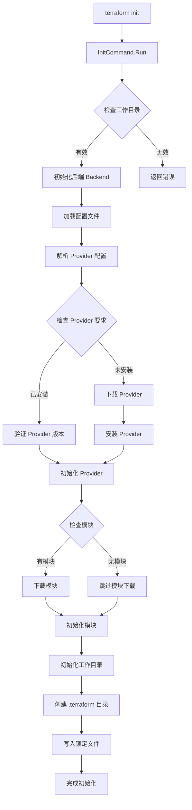

以下是 Terraform init 命令的主要流程图：

主要步骤说明：
命令入口
用户执行 terraform init
调用 InitCommand.Run()
环境检查
检查工作目录是否有效
验证目录权限
后端初始化
初始化状态存储后端
配置远程或本地后端
Provider 处理
解析 Provider 配置
下载所需的 Provider
验证 Provider 版本
安装并初始化 Provider
模块处理
检查是否有模块依赖
下载所需的模块
初始化模块
工作目录初始化
创建 .terraform 目录
写入锁定文件
完成初始化
补充说明：
1. 整个初始化过程是串行的，每个步骤都依赖于前一个步骤的成功完成
2. 如果任何步骤失败，都会返回错误并终止初始化过程
初始化完成后，才能执行其他 Terraform 命令（如 plan、apply）
锁定文件（.terraform.lock.hcl）用于确保 Provider 版本的一致性